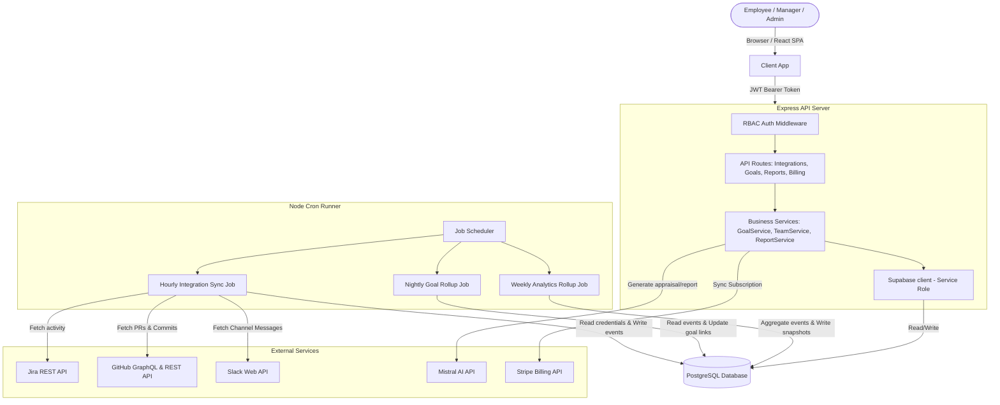

# Implementation Plan: Premium Plan Feature for ImpactlyAI

This plan outlines the architecture, database schema, background jobs, scoring algorithms, and user interface components needed to deliver the **Premium Plan** feature for ImpactlyAI. It incorporates specific user feedback and details the differences from the previously implemented integrations plan (`docs/plans/make-an-indetail-implementation-integrations.md`).

---

## Delta Analysis: Already Implemented vs. Net-New

Based on a thorough review of the codebase and the earlier integration plan (`docs/plans/make-an-indetail-implementation-integrations.md`), the following status is identified:

### 1. What is Already Implemented
* **Tenant & Org Hierarchy**: Databases and APIs for `organizations`, `org_members`, `departments`, `teams`, `team_members`, and `team_closure` with role-based checks (direct/indirect).
* **Goal Framework**: CRUD endpoints and schema for `goals`, `goal_assignees`, `goal_key_results`, `goal_links`, and `goal_updates`. Progress recomputation triggers (`recompute_goal_progress()`) roll up leaf progress to parents.
* **OAuth Infrastructure**: Connection flows, site-selection, and state verification for Jira, GitHub, and Slack integrations. Token encryption at rest is operational.
* **Basic Webhooks**: Raw webhook event handlers that verify signatures and register events in `integration_events`. GitHub/Jira webhooks update explicit `goal_links.is_done` states.
* **Weekly Sync Scheduler**: Hourly job (`weeklySyncJob.ts`) that pulls recent issues/PRs to populate weekly text summaries.

### 2. What is Net-New / Left Out (To Be Built)
* **Unified Activity Layer**:
  * Mapping Jira, GitHub, and Slack events into a standard `activity_events` table (all feeds unified).
  * Slack background sync job that periodically fetches messaging and threads activity for linking.
* **Automated Goal Mapping via Signals**:
  * Logic and job routines that fetch `activity_events` (commits, PR reviews, Slack participation, Jira comments) and automatically update corresponding `goal_key_results.current_value`.
* **Analytics Engine**:
  * Net-new scoring module calculating: `Contribution Score`, `Collaboration Score`, `Goal Completion Score`, `Consistency Score`, and `Impact Score` to produce an overall `Performance Index`.
  * Weekly scheduler compiling aggregate snapshots into `analytics_snapshots` table.
* **AI Report Generator Pipeline**:
  * Trigger-driven "Generate Report" workflow compiling goals, sync items, and activity metrics into structured context.
  * Integration with Mistral AI (`mistral-large-latest`) to generate 9 sections (Summary, Achievements, Goals, Collaboration, Technical, Risks, Improvements, Rating, Evidence) without hallucinations.
  * Support for 6 report types: Weekly, Monthly, Quarterly, Self Appraisal, Manager Appraisal, and Promotion Readiness.
* **Premium Dashboard & Widgets**:
  * Premium widgets: Goal progress charts, Jira activity metrics, GitHub contribution heatmaps, Slack communication volumes, AI Performance Index charts, and report generation controls.
* **Billing / Stripe Hook Stub**:
  * `subscriptions` table and associated middleware to lock Premium features to subscribed organizations.

---

## User Decisions Incorporated

> [!NOTE]
> * **Model Selection**: Default to Mistral (`mistral-large-latest`) via the native client for all appraisal and performance report generation steps.
> * **Slack Data Sync Scope**: The background sync will only scan and sync from channels that the user or manager has explicitly selected in their Slack integration preferences.

---

## System Architecture



---

## Database Schema

```sql
-- ============================================================================
-- Migrations: 2026-06-19_premium_plan_schema.sql
-- ============================================================================

-- 1. Subscriptions Table
CREATE TABLE IF NOT EXISTS subscriptions (
  id UUID PRIMARY KEY DEFAULT gen_random_uuid(),
  org_id UUID NOT NULL REFERENCES organizations(id) ON DELETE CASCADE,
  stripe_subscription_id TEXT UNIQUE,
  stripe_customer_id TEXT,
  tier TEXT NOT NULL DEFAULT 'free' CHECK (tier IN ('free', 'premium')),
  status TEXT NOT NULL CHECK (status IN ('active', 'canceled', 'past_due', 'trialing')),
  current_period_start TIMESTAMPTZ,
  current_period_end TIMESTAMPTZ,
  created_at TIMESTAMPTZ DEFAULT NOW() NOT NULL,
  updated_at TIMESTAMPTZ DEFAULT NOW() NOT NULL,
  UNIQUE(org_id)
);

CREATE INDEX IF NOT EXISTS idx_subscriptions_org ON subscriptions(org_id);
ALTER TABLE subscriptions ENABLE ROW LEVEL SECURITY;
CREATE POLICY "Orgs can read own subscription" ON subscriptions
  FOR SELECT USING (EXISTS (
    SELECT 1 FROM org_members WHERE org_members.org_id = subscriptions.org_id AND org_members.user_id = auth.uid()
  ));

-- 2. Unified Activity Layer: Normalized Activity Events
CREATE TABLE IF NOT EXISTS activity_events (
  id UUID PRIMARY KEY DEFAULT gen_random_uuid(),
  user_id UUID NOT NULL REFERENCES users(id) ON DELETE CASCADE,
  org_id UUID NOT NULL REFERENCES organizations(id) ON DELETE CASCADE,
  provider TEXT NOT NULL CHECK (provider IN ('jira', 'github', 'slack')),
  event_type TEXT NOT NULL, -- 'commit', 'pull_request', 'review', 'issue', 'message', 'comment'
  external_id TEXT NOT NULL,
  external_key TEXT, -- e.g., 'PROJ-123' or 'owner/repo#42'
  timestamp TIMESTAMPTZ NOT NULL,
  details JSONB DEFAULT '{}'::jsonb NOT NULL,
  impact_score NUMERIC(5,2) DEFAULT 0.00 CHECK (impact_score >= 0),
  created_at TIMESTAMPTZ DEFAULT NOW() NOT NULL,
  UNIQUE(provider, external_id)
);

CREATE INDEX IF NOT EXISTS idx_activity_events_user_time ON activity_events(user_id, timestamp DESC);
CREATE INDEX IF NOT EXISTS idx_activity_events_org_provider ON activity_events(org_id, provider);
ALTER TABLE activity_events ENABLE ROW LEVEL SECURITY;
CREATE POLICY "Users can read own activity events" ON activity_events
  FOR SELECT USING (auth.uid() = user_id);
CREATE POLICY "Managers can read visible user activity events" ON activity_events
  FOR SELECT USING (EXISTS (
    SELECT 1 FROM org_members WHERE org_members.org_id = activity_events.org_id AND org_members.user_id = auth.uid() AND org_members.role IN ('admin', 'owner')
  ));

-- 3. Analytics Snapshots
CREATE TABLE IF NOT EXISTS analytics_snapshots (
  id UUID PRIMARY KEY DEFAULT gen_random_uuid(),
  user_id UUID NOT NULL REFERENCES users(id) ON DELETE CASCADE,
  org_id UUID NOT NULL REFERENCES organizations(id) ON DELETE CASCADE,
  period_start DATE NOT NULL,
  period_end DATE NOT NULL,
  contribution_score NUMERIC(5,2) NOT NULL DEFAULT 0.00,
  collaboration_score NUMERIC(5,2) NOT NULL DEFAULT 0.00,
  goal_completion_score NUMERIC(5,2) NOT NULL DEFAULT 0.00,
  consistency_score NUMERIC(5,2) NOT NULL DEFAULT 0.00,
  impact_score NUMERIC(5,2) NOT NULL DEFAULT 0.00,
  performance_index NUMERIC(5,2) NOT NULL DEFAULT 0.00,
  metadata JSONB DEFAULT '{}'::jsonb,
  created_at TIMESTAMPTZ DEFAULT NOW() NOT NULL,
  UNIQUE(user_id, period_start, period_end)
);

CREATE INDEX IF NOT EXISTS idx_analytics_snapshots_user_period ON analytics_snapshots(user_id, period_start, period_end);
ALTER TABLE analytics_snapshots ENABLE ROW LEVEL SECURITY;
CREATE POLICY "Users can read own analytics" ON analytics_snapshots
  FOR SELECT USING (auth.uid() = user_id);

-- 4. AI Generated Performance Reports
CREATE TABLE IF NOT EXISTS performance_reports (
  id UUID PRIMARY KEY DEFAULT gen_random_uuid(),
  user_id UUID REFERENCES users(id) ON DELETE CASCADE, -- NULL for team reports
  team_id UUID REFERENCES teams(id) ON DELETE SET NULL, -- NULL for employee reports
  org_id UUID NOT NULL REFERENCES organizations(id) ON DELETE CASCADE,
  generated_by UUID NOT NULL REFERENCES users(id) ON DELETE SET NULL,
  report_type TEXT NOT NULL CHECK (report_type IN ('weekly', 'monthly', 'quarterly', 'self_appraisal', 'manager_appraisal', 'promotion_readiness')),
  period_start DATE NOT NULL,
  period_end DATE NOT NULL,
  executive_summary TEXT NOT NULL,
  key_achievements TEXT NOT NULL,
  goal_progress TEXT NOT NULL,
  collaboration_analysis TEXT NOT NULL,
  technical_contributions TEXT NOT NULL,
  risks_blockers TEXT NOT NULL,
  improvement_suggestions TEXT NOT NULL,
  performance_rating TEXT NOT NULL,
  evidence_supporting_rating TEXT NOT NULL,
  raw_data_snapshot JSONB DEFAULT '{}'::jsonb NOT NULL,
  created_at TIMESTAMPTZ DEFAULT NOW() NOT NULL,
  updated_at TIMESTAMPTZ DEFAULT NOW() NOT NULL
);

CREATE INDEX IF NOT EXISTS idx_performance_reports_target ON performance_reports(org_id, user_id, team_id);
ALTER TABLE performance_reports ENABLE ROW LEVEL SECURITY;
CREATE POLICY "Users can read own reports" ON performance_reports
  FOR SELECT USING (auth.uid() = user_id OR auth.uid() = generated_by);
```

---

## Backend APIs

### Subscription & Billing (`/api/billing`)
* `GET /api/billing/:orgId/subscription`
  * **Role Required**: Org Member+
  * **Returns**: `{ success: true, data: { tier: 'free'|'premium', status: 'active'|'canceled', current_period_end } }`
* `POST /api/billing/:orgId/checkout`
  * **Role Required**: Org Admin+
  * **Body**: `{ successUrl: string, cancelUrl: string }`
  * **Returns**: `{ success: true, data: { sessionId: string, checkoutUrl: string } }`

### Performance Reports (`/api/reports`)
* `GET /api/reports/:orgId`
  * **Role Required**: Org Member+
  * **Query**: `userId` (optional), `teamId` (optional)
  * **Returns**: `{ success: true, data: PerformanceReport[] }`
* `POST /api/reports/:orgId/generate`
  * **Role Required**: Org Member+ (for self), Manager+ (for team/employees)
  * **Body**: `{ userId?: string, teamId?: string, reportType: string, periodStart: string, periodEnd: string }`
  * **Returns**: `{ success: true, data: PerformanceReport }`
* `DELETE /api/reports/:orgId/:reportId`
  * **Role Required**: Manager+ (or report creator)
  * **Returns**: `{ success: true, data: null }`

---

## Proposed Changes

### Database Layer
#### [NEW] [2026-06-19_premium_plan_schema.sql](file:///d:/Vibe%20Coded/worklog-ai/supabase-migrations/2026-06-19_premium_plan_schema.sql)
Creates tables for subscriptions, unified activity events, analytics snapshots, and performance reports. Adds indices, RLS policies, and trigger helpers.

### Backend Application Services & Routes
#### [NEW] [activitySyncService.ts](file:///d:/Vibe%20Coded/worklog-ai/server/src/services/activitySyncService.ts)
Fetches data from Jira, GitHub, and Slack (only channels selected by managers/employees). Normalizes details and populates the `activity_events` table.

#### [NEW] [analyticsEngine.ts](file:///d:/Vibe%20Coded/worklog-ai/server/src/services/analyticsEngine.ts)
Calculates scores for Contribution, Collaboration, Goal Completion, Consistency, and Impact, compiling them into a final Performance Index. Writes weekly aggregated data into `analytics_snapshots`.

#### [NEW] [reportGeneratorService.ts](file:///d:/Vibe%20Coded/worklog-ai/server/src/services/reportGeneratorService.ts)
Gathers unified activity events, goals, progress states, and previous sync items to generate structured context. Submits prompt instructions to the Mistral AI API (`mistral-large-latest`) and parses response.

#### [NEW] [billing.ts](file:///d:/Vibe%20Coded/worklog-ai/server/src/routes/billing.ts)
Endpoints for checking organization subscription tiers, creating Stripe sessions, handling Stripe billing portal redirects, and managing Stripe webhooks.

#### [NEW] [reports.ts](file:///d:/Vibe%20Coded/worklog-ai/server/src/routes/reports.ts)
Endpoints for managers and employees to trigger, retrieve, and delete performance reports.

#### [MODIFY] [integrations.ts](file:///d:/Vibe%20Coded/worklog-ai/server/src/routes/integrations.ts)
Update OAuth flow confirmation scopes to request read permissions for Jira, GitHub repositories/commits, and Slack channels.

#### [MODIFY] [authz.ts](file:///d:/Vibe%20Coded/worklog-ai/server/src/services/authz.ts)
Integrate Premium Plan tier validation. Ensure free-tier organizations are gated from calling sync workers or generating AI reports.

### Background Job Workers
#### [NEW] [activitySyncJob.ts](file:///d:/Vibe%20Coded/worklog-ai/server/src/jobs/activitySyncJob.ts)
Chronologically runs hourly to query active Premium integrations and kick off incremental syncing. Uses atomic advisory locks on a per-user basis.

### Frontend Pages & Components
#### [NEW] [reportsApi.ts](file:///d:/Vibe%20Coded/worklog-ai/client/src/lib/reportsApi.ts)
Client integrations module for report generation, retrieval, and billing redirects.

#### [NEW] [PremiumDashboard.tsx](file:///d:/Vibe%20Coded/worklog-ai/client/src/pages/PremiumDashboard.tsx)
The unified view displaying widgets for Goal Progress, Jira Activity (Bar Chart), GitHub Activity (Commit Heatmap), Slack Collaboration, Performance Ratings, and historical reports.

#### [NEW] [ReportHistory.tsx](file:///d:/Vibe%20Coded/worklog-ai/client/src/pages/ReportHistory.tsx)
Listing page for viewing previously generated Weekly, Monthly, and Appraisal reports.

---

## Verification Plan

### Automated Tests
* Create `server/src/__tests__/services/analyticsEngine.test.ts` to test Contribution and Collaboration index calculation logic.
* Run `npm run typecheck` to confirm workspace TS compatibility.

### Manual Verification
1. Authenticate with Jira, GitHub, and Slack under user integration settings. Select specific Slack channels to monitor.
2. Force the hourly background sync worker run via curl command. Confirm `activity_events` rows are written.
3. Click "Generate Report" on the Premium Dashboard. Validate that the Mistral LLM correctly compiles and parses the section breakdown.
4. Verify RLS constraints: attempt to request another user's performance report as an employee, and confirm it returns a `403 Forbidden` response.
