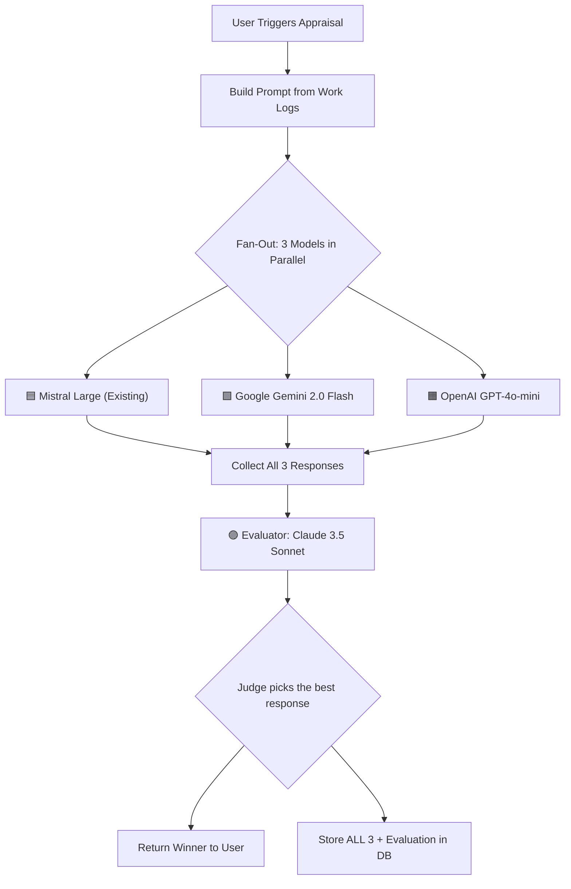
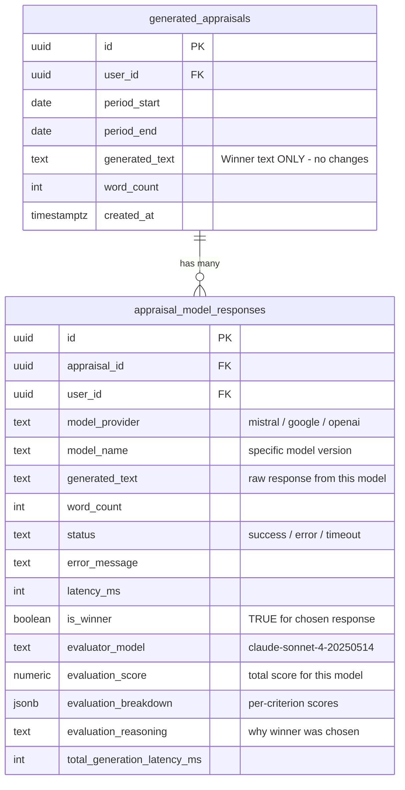

# Multi-Model AI Appraisal with Evaluator — Implementation Plan

## 1. Current State Analysis

Your current architecture uses a **single AI provider** for all GenAI work:

| Component | Current Implementation |
|---|---|
| **Provider** | Mistral AI (`@mistralai/mistralai` SDK) |
| **Model** | `mistral-large-latest` |
| **Config** | [mistral.ts](file:///Users/akshaymehta/Documents/vibe-coding/worklog-ai/server/src/lib/mistral.ts) — single API key |
| **Appraisal Generation** | [appraisal.ts](file:///Users/akshaymehta/Documents/vibe-coding/worklog-ai/server/src/routes/appraisal.ts) — calls Mistral once, saves result |
| **Chat / Summaries** | [chat.ts](file:///Users/akshaymehta/Documents/vibe-coding/worklog-ai/server/src/routes/chat.ts) + [summaryService.ts](file:///Users/akshaymehta/Documents/vibe-coding/worklog-ai/server/src/lib/summaryService.ts) — Mistral only |
| **Database** | `generated_appraisals` table stores one `generated_text` per request |

> [!IMPORTANT]
> The `.env.production.example` already has `ANTHROPIC_API_KEY` listed but unused. This is a good starting point.

---

## 2. Proposed Architecture



### How It Works
1. **Fan-Out**: The same prompt is sent to all 3 generation models **in parallel** (`Promise.allSettled`).
2. **Collect**: Wait for all responses. If a model fails, mark it as `error` — the evaluator works with whatever succeeded.
3. **Evaluate**: Send all successful responses to the **evaluator model** with a structured rubric.
4. **Store**: Save all 3 raw responses, the evaluator's reasoning, and the winning model to the database.
5. **Return**: Send the winning response to the user.

---

## 3. Model Recommendations

### Generation Models (all 3 produce the appraisal)

| # | Model | Provider | Why This Model | Cost (per 1M tokens) | Strengths |
|---|---|---|---|---|---|
| 1 | **Mistral Large** | Mistral AI | Already integrated, no new SDK | ~$2 input / $6 output | Strong structured writing, EU-hosted |
| 2 | **Gemini 2.0 Flash** | Google AI | Extremely fast + cheap, great for creative text | ~$0.10 input / $0.40 output | Speed, cost-efficiency, large context |
| 3 | **GPT-4o-mini** | OpenAI | Best-in-class instruction following | ~$0.15 input / $0.60 output | Polish, professional tone, reliable |

### Evaluator Model (judges the 3 responses)

| Model | Provider | Why |
|---|---|---|
| **Claude 3.5 Sonnet** | Anthropic | Best analytical/evaluation capabilities. Anthropic key already in your env template. Claude is widely regarded as the best "judge" model due to its reasoning depth and low bias. |

> [!TIP]
> **Why Claude as evaluator?** Research from LMSYS and multiple LLM-as-judge papers show Claude models have the lowest self-bias and highest inter-annotator agreement when scoring other models' outputs. It's the gold standard for LLM evaluation tasks.

### Alternative Evaluator Options
If you prefer not to add Anthropic, these are solid alternatives:
- **Gemini 2.0 Flash** (already added as generator — can double as evaluator with a separate prompt)
- **GPT-4o** (strong evaluation capabilities, but slight self-preference bias if GPT-4o-mini is a generator)

---

## 4. Database Schema Changes

> [!IMPORTANT]
> The existing `generated_appraisals` table is **NOT modified**. It continues to store only the final winning response — exactly as it does today. All multi-model metadata lives exclusively in the new table.

### Existing Table: `generated_appraisals` (UNCHANGED)

This table stays exactly as-is. The winning model's response text is inserted here as `generated_text`, just like today's single-model flow. The user and frontend never know multiple models were involved.

### New Table: `appraisal_model_responses`

This table stores **all 3 model responses + evaluation metadata** for internal analytics. It is a backend-only table — never exposed to the frontend.

```sql
-- Migration: 004_multi_model_appraisal.sql

-- Store individual model responses and evaluation data for each appraisal generation
CREATE TABLE IF NOT EXISTS appraisal_model_responses (
  id UUID PRIMARY KEY DEFAULT gen_random_uuid(),
  appraisal_id UUID NOT NULL REFERENCES generated_appraisals(id) ON DELETE CASCADE,
  user_id UUID NOT NULL REFERENCES users(id) ON DELETE CASCADE,

  -- Model identification
  model_provider TEXT NOT NULL,          -- 'mistral', 'google', 'openai'
  model_name TEXT NOT NULL,              -- 'mistral-large-latest', 'gemini-2.0-flash', 'gpt-4o-mini'

  -- Response data
  generated_text TEXT,                   -- The raw response (NULL if model errored)
  word_count INTEGER,
  status TEXT NOT NULL DEFAULT 'success' CHECK (status IN ('success', 'error', 'timeout')),
  error_message TEXT,                    -- Error details if status != 'success'
  latency_ms INTEGER,                   -- Response time in milliseconds

  -- Evaluation results (populated for ALL rows in a batch)
  is_winner BOOLEAN DEFAULT false,       -- TRUE for the response chosen by evaluator
  evaluator_model TEXT,                  -- 'claude-sonnet-4-20250514'
  evaluation_score NUMERIC(4,2),         -- Total score for THIS response (e.g., 8.50)
  evaluation_breakdown JSONB,            -- { "specificity": 9, "alignment": 8, ... }
  evaluation_reasoning TEXT,             -- Why the winner was chosen (same across batch)

  -- Metadata
  total_generation_latency_ms INTEGER,   -- End-to-end time for all models + evaluation
  created_at TIMESTAMPTZ DEFAULT NOW()
);

CREATE INDEX IF NOT EXISTS idx_model_responses_appraisal 
  ON appraisal_model_responses(appraisal_id);
CREATE INDEX IF NOT EXISTS idx_model_responses_user 
  ON appraisal_model_responses(user_id, created_at DESC);
CREATE INDEX IF NOT EXISTS idx_model_responses_winner 
  ON appraisal_model_responses(is_winner) WHERE is_winner = true;

ALTER TABLE appraisal_model_responses ENABLE ROW LEVEL SECURITY;
CREATE POLICY "Users can view own model responses" 
  ON appraisal_model_responses FOR SELECT USING (auth.uid() = user_id);
CREATE POLICY "Users can insert own model responses" 
  ON appraisal_model_responses FOR INSERT WITH CHECK (auth.uid() = user_id);
```

### Summary of What Gets Stored



> [!TIP]
> **Why store evaluation data in every row?** Each row already represents one model's response for one appraisal. Adding the evaluation fields here means a single query like `SELECT * FROM appraisal_model_responses WHERE appraisal_id = X` gives you everything: all responses, all scores, and the winner — no JOINs needed.

---

## 5. Backend Implementation

### 5.1 New Files to Create

```
server/src/lib/
├── mistral.ts          (existing — keep as-is)
├── googleAI.ts         (NEW — Google Gemini client)
├── openAI.ts           (NEW — OpenAI client)
├── anthropic.ts        (NEW — Claude evaluator client)
├── multiModelService.ts (NEW — orchestration layer)
└── evaluatorService.ts  (NEW — evaluation prompt + parsing)
```

### 5.2 `googleAI.ts` — Google Gemini Client

```typescript
import { GoogleGenAI } from '@google/genai'

const googleApiKey = process.env.GOOGLE_AI_API_KEY

if (!googleApiKey) {
  console.warn('Warning: GOOGLE_AI_API_KEY not set. Gemini generation will be skipped.')
}

export const googleAI = new GoogleGenAI({ apiKey: googleApiKey || '' })
export const geminiModel = 'gemini-2.0-flash'
export const isGoogleConfigured = !!googleApiKey
```

### 5.3 `openAI.ts` — OpenAI Client

```typescript
import OpenAI from 'openai'

const openaiApiKey = process.env.OPENAI_API_KEY

if (!openaiApiKey) {
  console.warn('Warning: OPENAI_API_KEY not set. GPT generation will be skipped.')
}

export const openai = new OpenAI({ apiKey: openaiApiKey || '' })
export const gptModel = 'gpt-4o-mini'
export const isOpenAIConfigured = !!openaiApiKey
```

### 5.4 `anthropic.ts` — Claude Evaluator Client

```typescript
import Anthropic from '@anthropic-ai/sdk'

const anthropicApiKey = process.env.ANTHROPIC_API_KEY

if (!anthropicApiKey) {
  console.warn('Warning: ANTHROPIC_API_KEY not set. Evaluation will fall back to first successful response.')
}

export const anthropic = new Anthropic({ apiKey: anthropicApiKey || '' })
export const evaluatorModel = 'claude-sonnet-4-20250514'
export const isAnthropicConfigured = !!anthropicApiKey
```

### 5.5 `multiModelService.ts` — Core Orchestration

```typescript
// Pseudocode for the orchestration layer

interface ModelResponse {
  provider: string         // 'mistral' | 'google' | 'openai'
  model: string            // specific model name
  text: string | null
  status: 'success' | 'error' | 'timeout'
  error?: string
  latencyMs: number
}

interface MultiModelResult {
  responses: ModelResponse[]
  winner: ModelResponse
  evaluation: {
    reasoning: string
    scores: Record<string, number>
    evaluatorModel: string
  }
  totalLatencyMs: number
}

export async function generateWithMultipleModels(prompt: string): Promise<MultiModelResult> {
  const startTime = Date.now()
  
  // 1. Fan-out to all 3 models in parallel
  const [mistralResult, geminiResult, openaiResult] = await Promise.allSettled([
    callMistral(prompt),
    callGemini(prompt),
    callOpenAI(prompt),
  ])
  
  // 2. Collect results, handle failures gracefully
  const responses = normalizeResults([mistralResult, geminiResult, openaiResult])
  
  // 3. Send successful responses to evaluator
  const successfulResponses = responses.filter(r => r.status === 'success')
  
  if (successfulResponses.length === 0) {
    throw new Error('All models failed to generate a response')
  }
  
  if (successfulResponses.length === 1) {
    // Only one succeeded — it wins by default
    return { winner: successfulResponses[0], ... }
  }
  
  // 4. Evaluate
  const evaluation = await evaluateResponses(prompt, successfulResponses)
  
  const totalLatencyMs = Date.now() - startTime
  return { responses, winner: evaluation.winner, evaluation, totalLatencyMs }
}
```

### 5.6 `evaluatorService.ts` — The Judge

The evaluator receives all responses and scores them on a rubric:

```typescript
const EVALUATION_PROMPT = `You are an expert evaluator of professional self-appraisal texts.

You will receive multiple AI-generated self-appraisals based on the same work logs and criteria.
Your job is to evaluate each response and pick the BEST one.

EVALUATION CRITERIA (score each 1-10):
1. **Specificity**: Does it cite concrete examples, project names, and metrics from the work logs?
2. **Criteria Alignment**: Does it directly address the company's appraisal criteria?
3. **Professional Tone**: Is it polished, authentic, and written in proper first-person?
4. **Structure**: Is it well-organized with clear paragraphs for each criterion?
5. **Completeness**: Does it cover all major accomplishments without being verbose?

ORIGINAL PROMPT:
{prompt}

RESPONSE A ({modelA}):
{responseA}

RESPONSE B ({modelB}):
{responseB}

RESPONSE C ({modelC}):
{responseC}

Respond in this exact JSON format:
{
  "scores": {
    "{modelA}": { "specificity": X, "alignment": X, "tone": X, "structure": X, "completeness": X, "total": X },
    "{modelB}": { "specificity": X, "alignment": X, "tone": X, "structure": X, "completeness": X, "total": X },
    "{modelC}": { "specificity": X, "alignment": X, "tone": X, "structure": X, "completeness": X, "total": X }
  },
  "winner": "<provider_name>",
  "reasoning": "2-3 sentence explanation of why the winner was chosen"
}`
```

### 5.7 Updated Appraisal Route

The existing `POST /api/appraisal/generate` endpoint will be updated:

```typescript
// In appraisal.ts - the generate endpoint changes

// Before: Single model call
// const result = await mistral.chat.complete({ ... })

// After: Multi-model orchestration
const multiResult = await generateWithMultipleModels(prompt)
const winnerText = multiResult.winner.text!

// Save the winning response to generated_appraisals — SAME INSERT AS TODAY
// No new columns, no schema change. The winning text goes in as `generated_text`.
const { data: appraisal } = await supabase
  .from('generated_appraisals')
  .insert({
    user_id: userId,
    period_start: body.period_start,
    period_end: body.period_end,
    generated_text: winnerText,
    word_count: winnerText.split(/\s+/).length,
  })
  .select()
  .single()

// Save ALL individual model responses + evaluation data (backend-only table)
for (const response of multiResult.responses) {
  await supabase.from('appraisal_model_responses').insert({
    appraisal_id: appraisal.id,
    user_id: userId,
    model_provider: response.provider,
    model_name: response.model,
    generated_text: response.text,
    word_count: response.text?.split(/\s+/).length || 0,
    status: response.status,
    error_message: response.error,
    latency_ms: response.latencyMs,
    is_winner: response.provider === multiResult.winner.provider,
    evaluator_model: multiResult.evaluation.evaluatorModel,
    evaluation_score: multiResult.evaluation.scores[response.provider]?.total || null,
    evaluation_breakdown: multiResult.evaluation.scores[response.provider] || null,
    evaluation_reasoning: multiResult.evaluation.reasoning,
    total_generation_latency_ms: multiResult.totalLatencyMs,
  })
}
```

---

## 6. Environment Variables

Add to `.env` and `.env.production.example`:

```bash
# ============================================
# AI Model API Keys
# ============================================

# Mistral AI (existing - generation model 1)
MISTRAL_API_KEY=your-mistral-key

# Google AI / Gemini (generation model 2)
GOOGLE_AI_API_KEY=your-google-ai-key

# OpenAI (generation model 3)
OPENAI_API_KEY=sk-...

# Anthropic / Claude (evaluator model)
ANTHROPIC_API_KEY=sk-ant-...
```

---

## 7. Frontend Changes

### Zero Frontend Changes Required

The frontend is **completely unaware** of the multi-model system. Here's what stays the same:

| Aspect | Status |
|---|---|
| `GeneratedAppraisal` type in `shared/index.ts` | **UNCHANGED** |
| API response shape from `POST /api/appraisal/generate` | **UNCHANGED** |
| Appraisal page UI | **UNCHANGED** |
| Appraisal history page | **UNCHANGED** |
| Chat interface | **UNCHANGED** |

The user sees exactly the same experience as today — a single generated appraisal text. They have no visibility into the fact that 3 models competed and an evaluator picked the best one.

> [!NOTE]
> **Design rationale**: Showing model comparison to users adds complexity without clear value. Users care about the quality of the output, not which model produced it. The multi-model evaluation is a backend quality mechanism, not a user feature.

The only potential future UI addition would be an **admin/analytics dashboard** (not user-facing) to track which model wins most often, average scores, and latency — but that's a separate, optional effort.

---

## 8. Graceful Degradation Strategy

The system should **never break** if a model is unavailable:

| Scenario | Behavior |
|---|---|
| All 3 models succeed | Evaluator picks the best |
| 2 of 3 models succeed | Evaluator compares the 2 that worked |
| Only 1 model succeeds | That response wins by default (no evaluation) |
| All 3 models fail | Return error to user (same as current behavior) |
| Evaluator (Claude) fails | Return the response from the fastest model |
| Only Mistral key is set | Falls back to current single-model behavior |

> [!NOTE]
> This degradation logic means the feature is **opt-in by API key presence**. If you only configure Mistral (current state), nothing changes. Add more keys → more models participate.

---

## 9. Cost Analysis

For a typical appraisal generation (~2000 tokens input, ~800 tokens output per model):

| Component | Cost per Request | Notes |
|---|---|---|
| Mistral Large | ~$0.009 | Existing cost |
| Gemini 2.0 Flash | ~$0.0005 | Very cheap |
| GPT-4o-mini | ~$0.0008 | Very cheap |
| Claude 3.5 Sonnet (evaluator) | ~$0.012 | Evaluates ~3000 tokens of combined responses |
| **Total per appraisal** | **~$0.022** | Up from $0.009 (single model) |

> [!TIP]
> **The total cost increase is ~$0.013 per generation** (~2.4× the current cost). For a user generating 4 appraisals/year, that's an extra ~$0.05/year — negligible.

---

## 10. Implementation Phases

### Phase 1: Foundation (Day 1-2)
- [ ] Create database migration `004_multi_model_appraisal.sql` (new table only, no ALTER)
- [ ] Create `googleAI.ts`, `openAI.ts`, `anthropic.ts` client files
- [ ] Install new npm packages: `@google/genai`, `openai`, `@anthropic-ai/sdk`
- [ ] Update `.env.production.example` with new API key entries

### Phase 2: Service Layer (Day 2-3)
- [ ] Create `multiModelService.ts` with parallel fan-out logic
- [ ] Create `evaluatorService.ts` with Claude evaluation prompt
- [ ] Add timeout handling per model (30s max per generation call)
- [ ] Add graceful degradation logic
- [ ] Unit test: mock all 3 providers + evaluator

### Phase 3: Integration (Day 3-4)
- [ ] Refactor `appraisal.ts` route to use `multiModelService`
- [ ] Winner text → `generated_appraisals` (same insert as today)
- [ ] All responses + evaluation → `appraisal_model_responses` (new table)
- [ ] Add PostHog events for multi-model tracking
- [ ] Test end-to-end with real API keys

### Phase 4: Polish (Day 4-5)
- [ ] Add response caching for identical prompts
- [ ] Load testing: ensure parallel calls don't hit rate limits
- [ ] Admin-only SQL queries/views for model performance analytics
- [ ] Documentation updates

---

## 11. Decisions Needed From You

Before I start building, please confirm:

1. **Model Selection**: Are you okay with **Mistral + Gemini 2.0 Flash + GPT-4o-mini** for generation and **Claude 3.5 Sonnet** for evaluation? Or do you have preferences?

2. **Chat Route**: Should the chat endpoint (`/api/chat`) also use multi-model, or keep it single-model (Mistral) for speed since it's conversational/streaming?

3. **Monthly Summaries**: Should the `summaryService.ts` (monthly summary generation) also go multi-model, or keep it single?

4. **Fallback Order**: If Claude (evaluator) is down, should we pick the response from:
   - (a) The fastest model, or
   - (b) A hardcoded preference order (e.g., GPT-4o-mini > Mistral > Gemini)?
