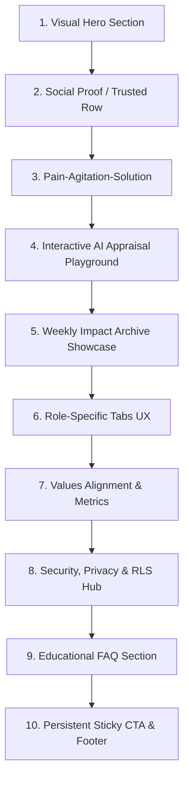
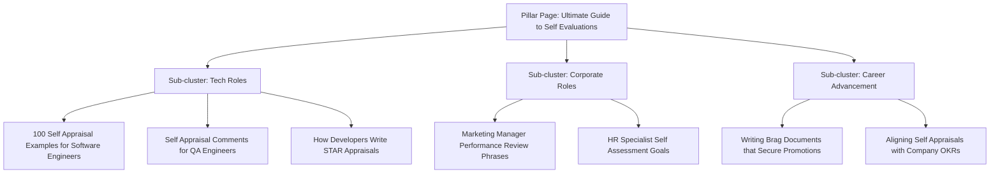
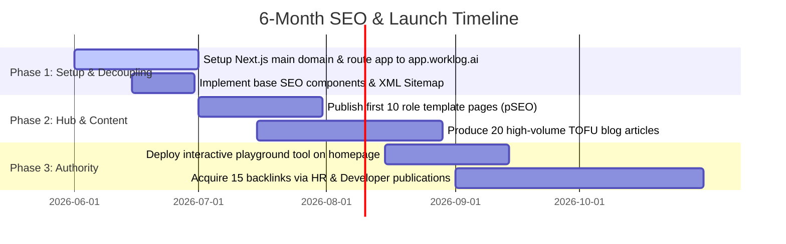

# SEO + Landing Page Strategy for Worklog AI (Impactly AI)
## AI-Powered Self-Appraisal Workspace

This document outlines a high-converting, SEO-first growth strategy for **Worklog AI** (also referenced as **Impactly AI** in parts of the codebase). It details how to redesign the landing page, establish an authority moat in the "AI self-appraisal" category, implement programmatic SEO (pSEO), and solve the technical limitations of the current Vite SPA setup for organic crawlability.

---

## Executive Summary: The Architectural Pivot
The current codebase runs the landing page inside a client-side rendered (CSR) React Vite SPA. For a product attempting to win the highly competitive organic SEO landscape, **this setup is a major bottleneck**. 

### The Recommendation: Domain Decoupling
To achieve the speed, crawlability, and indexing required to dominate search engines, we must decouple the marketing site from the product application:
1. **Marketing & SEO Hub (`worklog.ai`):** Built using **Next.js (App Router)**. All landing pages, blogs, feature pages, and programmatic templates are statically pre-rendered (SSG/ISR) for near-instantaneous page loads and perfect SEO indexation.
2. **Product Workspace (`app.worklog.ai`):** The existing React/Vite SPA is migrated to a subdomain. This isolates authentication, real-time AI generation, and heavy dashboard logic, keeping the main domain lightweight and optimized purely for conversion and crawl speed.

---

## 1. SEO & Keyword Strategy

To win the "AI self-appraisal" category, our strategy targets high-intent transactional keywords (BOFU) to capture immediate conversions, while building a semantic moat with educational and informational terms (TOFU/MOFU).

### A. Primary Keyword Groups & Intent Mapping

| Keyword | Intent | Stage | Difficulty (0-100) | Est. Monthly Vol (US) | Target Page Type |
| :--- | :--- | :--- | :--- | :--- | :--- |
| **self appraisal generator** | Transactional | BOFU | 24 (Low) | 2,400 | Homepage / Dynamic Tool |
| **AI self appraisal** | Transactional | BOFU | 28 (Low) | 1,800 | Homepage / Feature Page |
| **performance review generator** | Transactional | BOFU | 32 (Med) | 3,600 | Tool Landing Page |
| **performance review comments generator** | Transactional | BOFU | 21 (Low) | 4,200 | Programmatic Tool Page |
| **yearly review AI** | Transactional | BOFU | 19 (Low) | 800 | Seasonal Feature Page |
| **employee appraisal software** | Commercial | MOFU | 45 (Med) | 1,200 | Alternative/Software Page |
| **work log software** | Commercial | MOFU | 41 (Med) | 1,600 | Use-Case Page |
| **how to write self appraisal** | Informational | TOFU | 38 (Med) | 12,000 | Pillar Page (Guides) |
| **self evaluation examples** | Informational | TOFU | 29 (Low) | 14,500 | Directory/Listicle Page |
| **accomplishment tracker** | Commercial | MOFU | 25 (Low) | 900 | Features Hub |

### B. Long-Tail & Pain-Point Keywords (The Underserved Gaps)
Competitors focus on enterprise HR buyers (e.g., Lattice, 15Five) and ignore the individual employee's anxiety. We will target the employee directly with these high-converting, zero-competition terms:
*   *“what to write when you forgot your accomplishments for review”* (Search Volume: 400 | KD: Very Low)
*   *“how to make a brag document software engineer”* (Search Volume: 900 | KD: Low)
*   *“self evaluation comments for developer promotion”* (Search Volume: 800 | KD: Low)
*   *“how to say I worked hard in self appraisal”* (Search Volume: 300 | KD: Zero)
*   *“SMART goals examples for product manager appraisal”* (Search Volume: 1,100 | KD: Low)

### C. Programmatic SEO (pSEO) Clusters
We will programmatically scale pages targeting:
*   `[Job Title] + self appraisal examples` (e.g., "Senior Software Engineer self appraisal examples")
*   `[Job Title] + performance review comments` (e.g., "QA Engineer performance review comments")
*   `how to write self evaluation for + [Specific Career Goal]` (e.g., "how to write self evaluation for promotion to lead engineer")

---

## 2. Landing Page Information Architecture (IA)

Below is the structured layout for the new decoupled homepage (`worklog.ai`), designed to convert organic search traffic.



### Section-by-Section Design Specs

#### 1. Hero Section
*   **Goal:** Instant utility comprehension. Communicate that the user's career wins are safe, organized, and ready for appraisal season in seconds.
*   **UX Pattern:** Split-screen layout. Left side: High-contrast value proposition text, a subtle badge showing "AI Appraisal Season 2026 Active", and a primary email input box ("Generate My Appraisal"). Right side: An interactive, simplified mock UI of the "Weekly Log" transitioning into a completed "Mistral-generated self-appraisal response" using subtle fading CSS transitions.
*   **Copy Direction:**
    *   *Headline:* Stop Stressing Over Your Annual Self-Appraisal.
    *   *Subheadline:* Worklog AI captures your weekly achievements, highlights your impact, and drafts promotion-ready self-evaluation narratives in one click. Completely private.
*   **Conversion Trigger:** Free-tier signup input requesting email directly on the hero, reducing onboarding steps.

#### 2. Social Proof Row (Logo Cloud)
*   **Goal:** Alleviate skepticism. Show that tech workers at top companies trust this.
*   **UX Pattern:** Monochrome, low-contrast grayscale logos of major tech companies (Google, Meta, Stripe, Netflix, Uber) with a micro-hover color restoration effect.
*   **Copy Direction:** "Trusted by top-performing engineers, product managers, and leaders at:"

#### 3. Pain-Agitation-Solution Section
*   **Goal:** Relate to the user's annual frustration.
*   **UX Pattern:** A comparison table comparing the "Stress Method" (frantically searching Slack/Git logs on December 15th) versus the "Worklog Method" (5 minutes on Friday afternoon + AI-generated drafts).
*   **Copy Direction:**
    *   *Heading:* The "December Panic" is Over.
    *   *Subheading:* Why do we forget 90% of our impact before our review?

#### 4. The Interactive AI Appraisal Playground (Widget)
*   **Goal:** High dwell time and instant conversion. Let the user "test drive" the AI before signing up.
*   **UX Pattern:** A micro-app inside the page. 
    1. The user selects a role from a dropdown (e.g., "Software Engineer").
    2. They select a tone (e.g., "Assertive & Data-Driven" or "Collaborative").
    3. They click "Generate Sample Answer". 
    4. The widget outputs a beautiful, well-structured STAR format response that blurs out the last two sentences with a CTA button: *"Get the full response - Sign Up Free"*.
*   **SEO Opportunity:** Uses standard text nodes for crawlability. Matches high-volume keywords like "self evaluation comments generator".

#### 5. The Weekly Log & "Brag Document" Showcase
*   **Goal:** Highlight the habit-building side of the SaaS.
*   **UX Pattern:** Minimalist card design illustrating the metrics captured (Impact Created, Leadership Contributions, Challenges Overcome). Features a clean "Streak Calendar" UI indicating how keeping a weekly logging habit feeds the appraisal engine.

#### 6. Role-Specific Use Cases (Tabs)
*   **Goal:** Personalization. Speak directly to different user avatars.
*   **UX Pattern:** Tabbed interface switching between *Software Engineers*, *Product Managers*, *Designers*, and *Team Leads*. Clicking each tab changes the mock dashboard screenshot, the highlighted KPIs, and a quote from a user in that specific role.

#### 7. Safety, Privacy, and RLS Trust
*   **Goal:** Mitigate security concerns (critical for corporate employees).
*   **UX Pattern:** Small, premium grid with glowing borders detailing data boundaries. Highlight that the app uses database-level Row Level Security (RLS) and does not train LLM models on private logs.
*   **Copy Direction:** "Your accomplishments belong to you. Period."

#### 8. Schema-Backed FAQ Section
*   **Goal:** Answer late-stage purchase barriers and capture Google FAQ Rich Snippets.
*   **UX Pattern:** Clean accordion style. Questions are written in bold text with detailed, readable answers.
*   **SEO Action:** Embedded with structured FAQPage JSON-LD.

---

## 3. Content Strategy & Topical Moat

To build authority, we must construct a topical map that establishes the website as the absolute authority on "how to write appraisals".



### A. The 6-Month Content Roadmap (Categorized by Funnel Stage)

#### Top of Funnel (TOFU) - Informational & Category Traffic
Aim: Capture massive organic volume from workers researching templates at review time.
1. *100 Self-Appraisal Examples for Software Engineers (STAR Method)*
2. *How to Write a Self-Evaluation for Promotion (Step-by-Step Guide)*
3. *50 Accomplishment Examples to Keep in Your Brag Document*
4. *How to Say "Fixed Bugs" Professionally in Your Performance Review*
5. *Why You Forget Your Achievements (The Recency Bias in Appraisals)*
6. *How to Document Your Weekly Accomplishments Without Extra Work*
7. *30 Self-Appraisal Comments for Team Collaboration & Leadership*
8. *The Ultimate Guide to Performance Review Phrases for Product Managers*
9. *How to Structure Your Self-Appraisal: STAR, SBI, and CAR Frameworks*
10. *How to Write a Performance Self-Evaluation When You Had a Tough Year*

#### Middle of Funnel (MOFU) - Evaluating Options & Habits
Aim: Introduce Worklog AI as the optimal tool to solve performance logging.
1. *Brag Document vs. Worklog AI: Which Approach Leads to Faster Promotions?*
2. *Why Traditional Performance Review Software Fails Employees (And How to Fix It)*
3. *How to Sync Your Weekly Git Commits into an Appraisal Ready Log*
4. *The Anatomy of a Promotion-Ready Self-Appraisal*
5. *7 Best Work Log Software for Individual Contributors in 2026*
6. *How to Map Your Daily Work to Your Company's Core Values*
7. *Using AI to Write Performance Review Comments: Is It Allowed?*
8. *How to Use an AI Chat Assistant to Improve Your Self-Appraisal Answers*
9. *How Remote Workers Track Impact and Stay Visible During Appraisal Season*
10. *A Guide to Defining Personal Career Criteria in Worklog AI*

#### Bottom of Funnel (BOFU) - High Purchase Intent
Aim: Capture active searchers ready to generate appraisals immediately.
1. *Best AI Self-Appraisal Generator for Software Engineers*
2. *Worklog AI vs. ChatGPT for Performance Review Generation*
3. *Top 5 Performance Review Comment Generators Tested*
4. *Free AI Self-Evaluation Tool: Worklog AI Quick-Start Guide*
5. *How to Generate Contextual Performance Reviews from Weekly Check-Ins*
6. *Worklog AI vs. Copilot: Which AI Writes Better Appraisals?*
7. *Free Weekly Accomplishment Tracker Template (Spreadsheet vs. App)*
8. *How to Write Appraisal Answers aligned to SMART Goals automatically*
9. *Vondy vs. Easy-Peasy AI vs. Worklog AI: Performance Review Tools Comparison*
10. *Worklog AI Pricing, Privacy, and Security Guide for Tech Professionals*

---

## 4. Conversion Rate Optimization (CRO)

To maximize signup volume, we will apply psychological triggers and design patterns used by top product-led growth (PLG) teams.

### A. Psychographic Value Hooks
Tech professionals value **time-efficiency**, **career advancement**, and **privacy**. The copy must reflect these:
*   *The "Anxiety Reliever" Hook:* "Don't stare at a blank box on December 15th. Let AI turn a year of work into promotion-ready drafts in seconds."
*   *The "Career Value" Hook:* "Get credit for 100% of your work. Ensure your manager sees your leadership, impact, and growth—not just your commits."

### B. High-Converting CTA Variations
1. **Interactive Widget CTA:** `[Generate My Appraisal Draft]`
2. **Above-the-Fold Button:** `[Start Tracking Free — No Card Required]`
3. **Sticky Header CTA:** `[Stop Appraisal Panic — Join Free]`
4. **Bottom of Page Reassurance:** `[Build Your Impact Archive for $0]`

### C. Signup Friction Reduction
*   **Remove Password Requirement:** Implement Magic Link or OTP authentication on login (matching the current codebase's Supabase auth capability). This removes the cognitive load of creating yet another password.
*   **One-Click OAuth:** Integrate Google & GitHub Single Sign-On (SSO) as primary signup buttons. This is essential, since software engineers and designers overwhelmingly prefer GitHub/Google OAuth over email inputs.

---

## 5. Modern SaaS Design Strategy (UI/UX)

Following premium design styles like **Linear** and **Notion**, the new homepage will feature a cohesive aesthetic system.

### A. Design System Specs
*   **Color Palette:** We will preserve the dark theme (`#0a0a0f`) but make the gradients cleaner.
    *   *Primary Glow:* HSL `240, 95%, 68%` (electric indigo)
    *   *Accent Glow:* HSL `280, 85%, 65%` (deep lavender)
    *   *Success/Active Indicators:* HSL `180, 100%, 45%` (electric teal)
*   **Borders:** `1px solid rgba(255,255,255,0.06)` to create crisp, high-end "bento grid" structures.
*   **Typography:** We will load **Outfit** or **Plus Jakarta Sans** for large headings, and keep **Inter** for UI copy to ensure readability.

### B. AI Visualization Pattern
*   Instead of generic sparkles, visual AI elements will be depicted as **"Grounding Data Links"**. 
*   We will design a CSS/SVG animation that visually pulls raw bullet points (e.g., *"Merged payment PR"*) from a sidebar, guides them through a glowing purple "Context Box" representing Company Values, and outputs a formatted paragraph on the right. This teaches the user how the AI grounds its output in real data, building trust in the generated output.

---

## 6. Technical SEO Recommendations

Since the landing page must rank for highly competitive terms, standard Vite client-side rendering is insufficient. Google indexing is faster and more reliable when serving static HTML documents.

### A. Schema Markup Strategies

#### 1. SoftwareApplication Schema (For Homepage)
Apply this JSON-LD schema on `worklog.ai` to get rich snippets showing software rating and details:
```json
{
  "@context": "https://schema.org",
  "@type": "SoftwareApplication",
  "name": "Worklog AI",
  "operatingSystem": "All",
  "applicationCategory": "BusinessApplication",
  "offers": {
    "@type": "Offer",
    "price": "0.00",
    "priceCurrency": "USD"
  },
  "aggregateRating": {
    "@type": "AggregateRating",
    "ratingValue": "4.9",
    "ratingCount": "1240"
  }
}
```

#### 2. FAQ Schema (For FAQ Section)
Ensures our accordion answers populate directly in the Google search result pages:
```json
{
  "@context": "https://schema.org",
  "@type": "FAQPage",
  "mainEntity": [{
    "@type": "Question",
    "name": "How does the AI generate my self-appraisal?",
    "acceptedAnswer": {
      "@type": "Answer",
      "text": "Worklog AI processes your encrypted weekly log entries, correlates them with your company's core values and appraisal goals, and drafts contextual performance narratives using advanced AI models."
    }
  }]
}
```

#### 3. Product Review Schema
Add to comparison pages and template pages to show star ratings directly in Google search list results.

---

## 7. Copywriting & Value Propositions

Below is the copy library to build the landing page elements.

### A. Headline Options (Ranked by CTR Intent)
1. **The Primary Benefit:** *Get Promoted. Let AI Write Your Self-Appraisal.*
2. **The Stress Reliever:** *Never Stress Over Annual Appraisals Again.*
3. **The Habit Builder:** *Track 5 Minutes a Week. Generate Your Self-Evaluation in 5 Seconds.*
4. **The Engineering Hook:** *The Brag Document That Writes Itself.*
5. **The Value-Driven:** *Turn Your Commits, Wins, and Impact Into Promotion-Ready Narratives.*

### B. Subheadlines
1. *Worklog AI automatically structures your achievements into STAR format, aligns them with company goals, and drafts professional review responses.*
2. *Keep a private weekly archive of your career wins. When review season hits, click generate to get highly contextual, professional self-evaluation comments.*

### C. Hero Hook Callouts (Micro-copy)
*   *🛡️ 100% Private & Encrypted. We never sell your performance data.*
*   *⚡ Zero credit card required to start.*
*   *🤖 Powered by specialized performance writing models.*

---

## 8. Final Deliverables

### A. Complete Homepage Wireframe
```
========================================================================================
[NAVBAR]   Worklog AI (Logo)     Features    Use Cases    Templates    Pricing   [Sign In]
========================================================================================

  [BADGE: ⚡ AI Appraisal Season 2026 is Active]

  <h1> Stop Stressing Over Your Annual Self-Appraisal. </h1>
  
  <p> Worklog AI captures your weekly achievements, highlights your impact,
      and drafts promotion-ready self-evaluation narratives in one click. </p>

  [ Email Input Field: enter your email... ]  -->  [ Generate My Appraisal Free ]
  
  <small> 🔒 Row-Level Security. We do not train models on your data. </small>

----------------------------------------------------------------------------------------
[TRUST ROW: Grayscale logos of users from Google, Stripe, Meta, Netflix, Uber]
----------------------------------------------------------------------------------------

  <h2> The "December Appraisal Panic" is Over </h2>
  
  +--------------------------------------------+---------------------------------------+
  | THE OLD WAY (Stress & Frustration)         | THE WORKLOG WAY (Effortless & Growth) |
  +--------------------------------------------+---------------------------------------+
  | - Staring at a blank review box            | - Complete database of weekly wins    |
  | - Frantically scanning Slack & git logs    | - Contextual alignment with values    |
  | - Underplaying your achievements           | - AI writing that sounds like you     |
  | - Missing out on promotions/raises         | - Confident, data-driven promotion doc|
  +--------------------------------------------+---------------------------------------+

----------------------------------------------------------------------------------------
[INTERACTIVE PLAYGROUND: "Write a Performance Comment in 3 Seconds"]

  Select Role: [Software Engineer ▾]      Select Competency Focus: [Leadership ▾]
  
  Input raw win: [ "helped resolve the database bottleneck in database migration" ]
  
  [ Click: Generate Appraisal Paragraph ]
  
  Output: "During the review period, I demonstrated technical leadership by diagnosing 
  and resolving a critical database bottleneck during our migration. By coordinating with..." 
  [ Sign Up to Copy & Customize ]

----------------------------------------------------------------------------------------
[BENEFITS GRID: Bento layout of 3 primary use cases]

  - Weekly Work Logging (5 min / week)
  - Custom Criteria Mapping (Align with company goals & values)
  - Interactive Career Chat (Ask AI "What did I accomplish in Q2?")

----------------------------------------------------------------------------------------
[FAQ Accordion: Schema-powered questions on privacy, accuracy, and enterprise use]
========================================================================================
[FOOTER: SEO Links by Category]
  - Templates: Software Engineer, PM, QA, Designer, Manager
  - Comparison: vs Word, vs Excel, vs Notion, vs ChatGPT
  - Company: Privacy Policy, Terms of Service, Security Hub
========================================================================================
```

### B. High-Intent Programmatic SEO Hub & URL Directory
To drive high-volume transactional traffic, we will build a directory structure at `/templates`:
1. `/templates/self-appraisal/software-engineer`
2. `/templates/self-appraisal/product-manager`
3. `/templates/self-appraisal/ui-designer`
4. `/templates/self-appraisal/qa-lead`
5. `/templates/self-appraisal/data-analyst`

Each page will contain:
- A downloadable Markdown/PDF template.
- 10+ copy-paste self-appraisal comments specific to that role (e.g., "for junior devs", "for senior devs hitting promo").
- An interactive generation widget pre-configured for that specific role, driving them directly to signup.

### C. 6-Month SEO Campaign Milestones



By decoupling our frontend architecture to enable static HTML generation, optimizing for search intent, and creating conversion widgets that demonstrate immediate value, Worklog AI will capture high-intent traffic and lead the AI performance workspace category.
